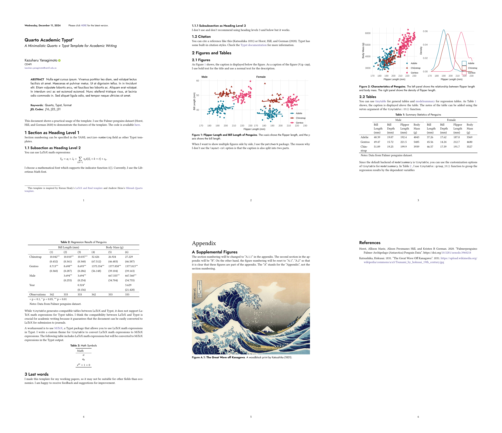

# Quarto-Academic-Typst Format

A Quarto + Typst format for academic documents.
The design is inspired by inspired by Kieran Healy's
[LaTeX and Rmd template](https://github.com/kjhealy/latex-custom-kjh) and
Andrew Heiss's [Hikmah Quarto template](https://github.com/andrewheiss/hikmah-academic-quarto).

Click the image below to see a [demo](https://kazuyanagimoto.com/quarto-academic-typst/template-full.pdf).
Code is available [here](https://github.com/kazuyanagimoto/quarto-academic-typst/blob/main/template-full.qmd).

[](https://kazuyanagimoto.com/quarto-academic-typst/template-full.pdf)

## Install

If you would like to add the clean theme to an existing directory:

```bash
quarto install extension kazuyanagimoto/quarto-academic-typst
```

or you can use a Quarto template that bundles a .qmd starter file:

```bash
quarto use template kazuyanagimoto/quarto-academic-typst
```

